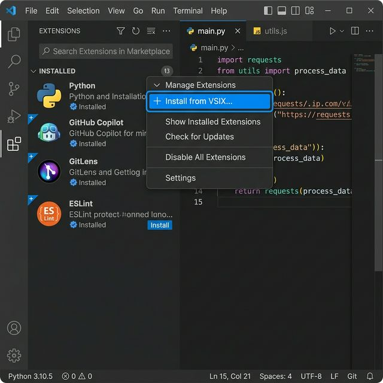
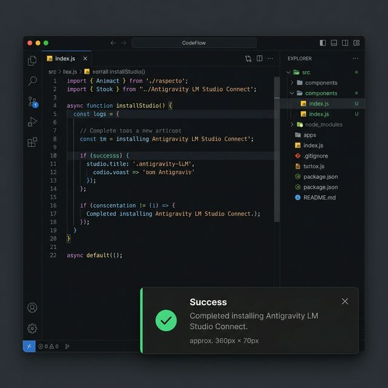

# Antigravity LM Studio Connect

O **Antigravity LM Studio Connect** (desenvolvido por Jaccon) é uma extensão poderosa para o Visual Studio Code projetada para integrar perfeitamente o seu fluxo de desenvolvimento local de IA com o **LM Studio**. A extensão oferece funcionalidades avançadas de chat, edição automática de código baseada em contexto e autocompletamento de código em tempo real (inline completion).

Tudo isso rodando localmente usando modelos de linguagem abertos, garantindo total privacidade do seu código fonte e isenção de custos com APIs.

## Funcionalidades Principais

- **Chat com IA no Sidebar do VSCode:** Uma aba dedicada ("LM Studio Connector") no seu Activity Bar para conversar com a IA.
- **Contextualização com o Arquivo Ativo:** A extensão compartilha de maneira inteligente o conteúdo do arquivo que você está editando no momento, permitindo que a IA compreenda o contexto sem você precisar copiar e colar.
- **Inserção e Edição Direta (Code Actions):** A interface de chat disponibiliza botões para `Insert`, `Replace` ou criar um `New File` diretamente com o código sugerido pela IA, acelerando seu desenvolvimento.
- **Modificação Automática (Auto-apply):** A IA entende comandos especiais (tags como `<create_file>` ou `<edit_file>`) e pode criar novos arquivos ou até aplicar alterações no documento inteiro automaticamente conforme sua solicitação.
- **Autocompletamento em Tempo Real (Inline Completion):** Conforme você digita, a extensão se comunica com o LM Studio para prever e sugerir continuações de código baseadas no contexto ao redor.

## Requisitos

1. **Visual Studio Code** (versão 1.80.0 ou superior).
2. [O LM Studio](https://lmstudio.ai) instalado e rodando em sua máquina local.
3. Servidor Local (Local Server) em execução no LM Studio:
   - Porta padrão: `1234`
   - Deve suportar as rotas OpenAI-compatíveis: `/v1/chat/completions` (para o Chat) e `/v1/completions` (para o autocompletamento).

## Instalação (Offline com VSIX)

### Como gerar o arquivo VSIX (Opcional)
Se você não encontrou o arquivo `.vsix` na pasta (por exemplo, após baixar o código-fonte pelo GitHub), você pode compilá-lo manualmente. Abra o terminal na raiz do projeto e rode:
```bash
npm install -g @vscode/vsce
npm install
vsce package
```
Isso irá gerar o arquivo de extensão `.vsix` (ex: `lmstudio-connector-0.0.1.vsix`).

### Passo a passo de instalação no VS Code

1. **Acesse a aba de Extensões:** Abra o Visual Studio Code. Na barra lateral esquerda, clique no ícone de *Extensões* (`Ctrl+Shift+X` ou `Cmd+Shift+X`).
2. **Selecione "Install from VSIX...":** No painel de Extensões, clique no ícone de três pontos `...` (Views and More Actions) no canto superior direito do menu lateral e selecione a opção **Install from VSIX...**.
   
   

3. **Navegue até o arquivo:** Uma janela será aberta. Navegue até o diretório onde o arquivo `.vsix` se encontra e selecione-o.
4. **Instalação Concluída:** Um aviso aparecerá no canto inferior direito informando que a extensão foi instalada com sucesso.
   
   

## Como Rodar e Conectar ao LM Studio (via API)

Para que a extensão funcione perfeitamente, o LM Studio precisa estar rodando um servidor local que simula a API da OpenAI. Siga os passos:

### 1. Preparando o LM Studio
1. Abra o aplicativo **LM Studio** em sua máquina.
2. Navegue até aba **↔️ Local Server** (ícone de servidor no menu lateral esquerdo).
3. No topo, selecione o modelo de IA que você deseja carregar para a memória.
4. No painel da direita, certifique-se de que a opção **Cross-Origin-Resource-Sharing (CORS)** está ativada.
5. Clique no botão azul **Start Server**.
6. O terminal interno do LM Studio indicará que a API está ativa, normalmente na porta `1234` (ex: `http://localhost:1234/v1`).

### 2. Configurando a Extensão no VS Code
Com o servidor rodando, abra seu VS Code:
1. Pressione `Cmd+,` (macOS) ou `Ctrl+,` (Windows/Linux) para abrir as **Settings**.
2. Na barra de pesquisa, digite `antigravity.lmStudio`.
3. Preencha as configurações conforme abaixo:
   - **Base URL:** Confirme que a URL é `http://localhost:1234/v1` (se não alterou a porta).
   - **Chat Model:** Insira o alias ou nome do modelo carregado (o LM Studio resolve automaticamente modelos recentes como `local-model` ou `default`).
   - **Autocomplete Enabled:** Marque (`true`) para ativar e receber sugestões de código diretamente no editor de texto.

### 3. Teste de Conexão
Para ter absoluta certeza de que VS Code e LM Studio estão se conversando:
* Pressione `Cmd+Shift+P` (ou `Ctrl+Shift+P`), pesquise pelo comando `Antigravity: Test Connection` e pressione *Enter*.
* Uma notificação de sucesso aparecerá no canto da sua tela caso a API esteja respondendo com êxito. A sua aba lateral **LM Studio Connector** também já estará com os sistemas operantes!

## Comandos Disponíveis

Ao abrir a paleta de comandos do VS Code, os seguintes comandos estão disponíveis:
- `Antigravity: Hello World` - Comando básico de teste da extensão.
- `Antigravity: Start Code Chat` - Abre e foca a janela webview do chat na barra lateral.
- `Antigravity: Test Connection` - Faz um healthcheck (verificação de conexão) na API em execução do LM Studio.

## Privacidade e Segurança

Seus dados não saem da sua máquina! Diferente de assistentes convencionais da nuvem, o Antigravity LM Studio interage exclusivamente com a rede local (`localhost`), processando todo o código fonte e as conversas de forma estritamente local, conferindo o mais alto grau de segurança para desenvolvimento de propriedade intelectual ou trabalhar sob regras estritas de não-vazamento de dados corporativos (NDA).

## Contribuição e Feedback

Sinta-se à vontade para reportar issues ou enviar PRs com melhorias para a integração da extensão.
Desenvolvido com ☕️ e IA por Jaccon.
